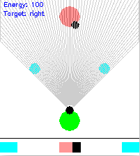

# Flatland RL Project

## Joint attention

This repo is a project I worked on in college for about 6 months, as a reasearch assistant in Vanderbilt's Artificial Intelligence and Visual Analogical Systems (AIVAS) lab.

The overall goal of my work there was to study "joint attention", a cognitive behavior where two people jointly direct their gaze at an object, understanding that the other person is looking at the object but still aware of their partner. 

To give a concrete example of joint attention: say two people are conversing and one directs their gaze at a picture on the wall. The other individual follows their partner's gaze and also looks at the picture, and the two start talking about it. They are both jointly aware of the picture, their partner, and the fact of their shared gaze. This extremely useful because it allows them to discuss the picture while keeping their gaze on it, rather than constantly looking back at their partner to make sure they are still looking at the same thing.

Joint attention develops slowly in infants, and is exhibited to varying degrees by other cognitively advanced species.

The aim of this project was to use reinforcement learning to train virtual agents to develop _gaze following_ which is a precursor to joint attention in humans.

## Flatland

In this repo, I've created a "Flatland" environment for virtual agents to navigate, as well as a handful of tasks to train the agents on. Flatland is a 2D arena containing one or more agents, and different types of objects. The agent percieves the world through a 1D vision vector, and acts by taking one of several allowed actions for a given task. For each task, the agent is rewarded for certain actions, and penalized for others. Using reinforcement learning, I attempt to train the agent through trial and error to maximize its reward when performing a task. 

The motivation for using this 2D environment is:
1. It's substantially less computationally expensive than a 3D world where agents have 2D vision
2. It still supports "vision", and agents trained in it could plausibly develop spatial awareness

As an example, in one task, two identical objects are placed in the arena, as well as a second agent. The second agent "looks" at one of the two objects. The first agent (the one we're training), is rewarded for collecting the object the second agent is looking at, and penalized for collecting the other. With sufficient RL training, it learns to follow the 'gaze' of the second agent, and earn the reward. 

## Code

- `flatland/flatland_objects.py` contains the code for different types of arenas, agents, and objects.
- `flatland/flatland_tasks.py` contains a few different task types, each of which specifies an arena setup and reward function that agent's can be trained on
- `learning_agents/dqn.py` contains the deep reinforcement learning architecture, which determines the behavior of the agent in the world by mapping from the input space (a "vision vector") to probabilities for each allowable action
- I typically tranined the network on Google Colab - this code can be found in `experiments/notebooks/FlatlandTest.py`
- Training can also be done locally using `experiments/train_local.py`

## Examples

Video compilations of agents trained on a few different tasks:
- [distinguish between colors](https://drive.google.com/file/d/1q93KJlvyzacNrBaZSjmoSFvxrFzLHEWR/view?usp=sharing)
- [follow another agent's gaze](https://drive.google.com/file/d/14sXnSM-JDvgCzxWsMUQLn3wiz9NTj4l_/view?usp=sharing)
